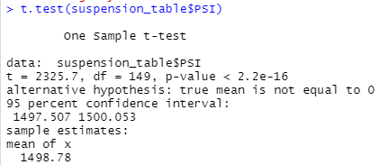
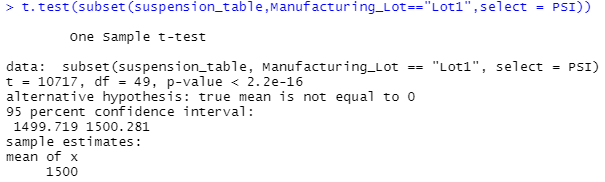
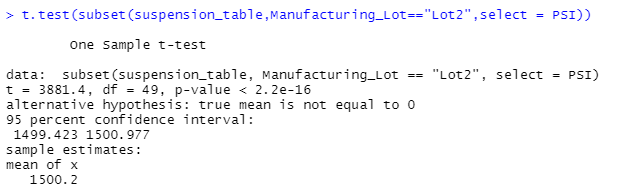
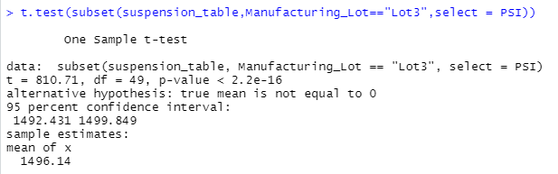

# MechaCar_Statistical_Analysis

## Purpose
AutosRUs senior leadership would like to take advantage of the vast data they have collected throughout the years to drive their decisions and improve their manufacturing process. In this particular case, they would like to resolve an issue that they've been seeing in the production line using data analysis.

## Linear Regression to Predict MPG

A csv file name [MechaCar_mpg.csv](MechaCar_mpg.csv) was provided with data for miles per gallon (mpg), vehicle length, vehicle weight, spoiler angle, ground clearance, and all wheel drive (awd) capabilities. 

To determine which parameters are able to predict mpg more accurately, we looked at its relationship versus vehicle length, vehicle weight, spoiler angle, ground clearance, and awd (shown above). 

Using R to plot the correlation between the various parameters, we can infer that vehicle length, ground clearance, and awd have a strong correlation with mpg, with a slope of 6.27, 3.54, and -3.41, respectively. Whereas, vehicle weight and spoiler angle have a weak relationship with mpg, with a slope of 0.00125 and 0.0688. Therefore, vehicle length, ground clearance, and awd provide a non-random amount of variance to the mpg values.

In addition, the r-squared value is 0.7149 which indicates that approximately 71% of all mpg predictions will be correct using this linear model. Finally, the p-value of the linear regression is 5.35e-11 which is much smaller than the 0.05% signicance level. Therefore, it can be stated that the slope of the linear model is not zero.

## Summary Statistics on Suspension Coils

The design specifications for the MechaCar suspension coils dictate that the variance of the suspension coils must not exceed 100 pounds per square inch. We were given a [second dataset](Suspension_Coil.csv) with suspension PSI for all vehicles made from lots 1 to 3. 

Briefly summarizing the descriptive stats for PSI, we find that the mean variance for all lots is 62.3. Digging down further into the mean variance for each lot, we find that lot 1 has a variance of 0.980, lot 2 has a variance of 7.50, and lot 3 has a variance of 170.3. It can then be concluded that lot 3 does not meet the current design specifications.

## T-Tests on Suspension Coils

We ran multiple t-tests to compare the PSI for all lots and for each individual lot against the mean PSI of the population (1500) to determine if any of these would be statistically different. As can be seen below, no statistical significance was detected as all p-values were below the 0.05% significance level. 

## Study Design: MechaCar vs Competition

In a study to compare Mechacar's fuel efficiency against the competition's, we used the gas mileage data from Mechacar and various other brands. 
Our null hypothesis is MechaCar is not more fuel efficient than the competition. Our alternate hypothesis is Mechacar is more fuel efficient than the competition.
As we are comparing multiple samples and their relationship with mpg, an Anova test would be the most useful statistical test. 
