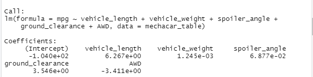
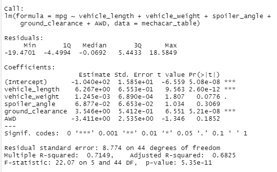
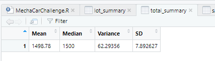
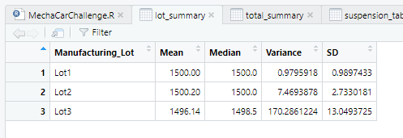

# MechaCar_Statistical_Analysis

## Purpose
AutosRUs senior leadership would like to take advantage of the vast data they have collected throughout the years to drive their decisions and improve their manufacturing process. In this particular case, they would like to resolve an issue that they've been seeing in the production line using data analysis.

## Linear Regression to Predict MPG

A csv file name [MechaCar_mpg.csv](MechaCar_mpg.csv) was provided with data for miles per gallon (mpg), vehicle length, vehicle weight, spoiler angle, ground clearance, and all wheel drive (awd) capabilities. 

To determine which parameters are able to predict mpg, we looked at its relationship versus vehicle length, vehicle weight, spoiler angle, ground clearance, and awd. Using R to plot the correlation between the various parameters, we can infer that vehicle length, ground clearance, and awd have a strong correlation with mpg, with a slope of 6.27, 3.54, and -3.41, respectively. Whereas vehicle weight and spoiler angle have a weak relationship with mpg, with a slope of 0.00125 and 0.0688. In addition, vehicle length, ground clearance, and awd statistically 

## Summary Statistics on Suspension Coils

The design specifications for the MechaCar suspension coils dictate that the variance of the suspension coils must not exceed 100 pounds per square inch. 

We were given another [dataset](Suspension_Coil.csv) with suspension PSI for all vehicles made from lots 1 to 3. The mean variance for all lots is 62.3. Digging down further into the mean variance for each lot, we find that lot 3 has a variance of 170.3, which exceeds the design specifications.

## T-Tests on Suspension Coils

## Study Design: MechaCar vs Competition